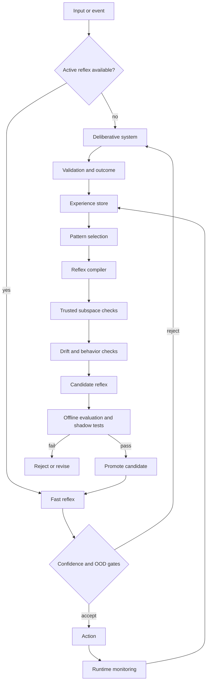
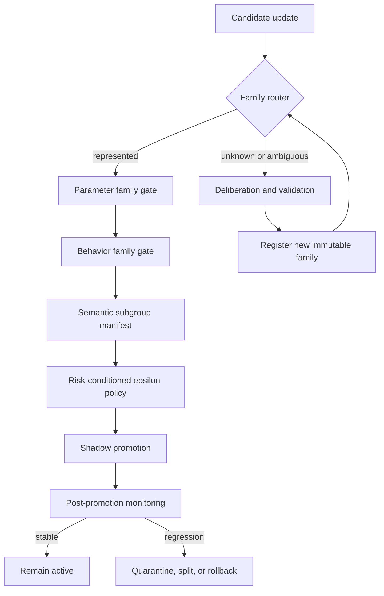
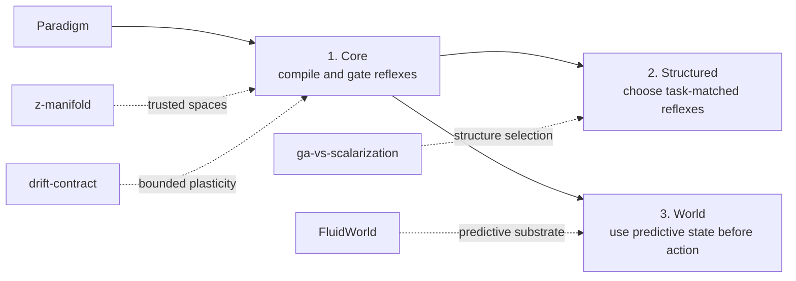
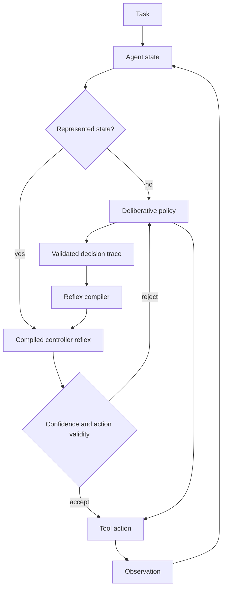
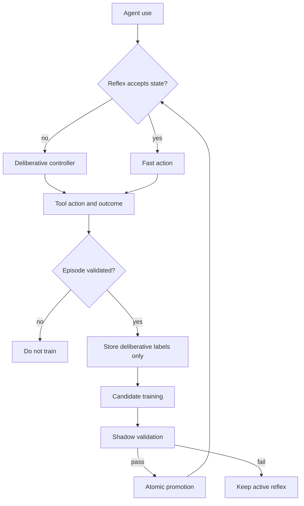

# Paradigm

**Continual reflex compilation for adaptive systems.**

Paradigm is a research framework for turning validated, expensive decisions into fast, specialized reflexes while keeping uncertainty, drift, and promotion explicit.

The central idea is simple:

1. A deliberative system handles unfamiliar or difficult cases.
2. Validated trajectories are stored as experience.
3. Repeated and stable behavior is compiled into a smaller reflex.
4. The reflex is calibrated and tested before promotion.
5. Low-confidence or out-of-distribution cases return to deliberation.
6. New candidates never replace the active reflex without evaluation.

Paradigm is not a claim that every task should be compressed into a reflex. The research question is when this transition is useful, safe, and measurable.

## Architecture



### Core invariant

```text
unfamiliar -> deliberate -> validate -> accumulate evidence
familiar   -> reflex     -> monitor  -> fall back when uncertain
```

### Current Core trust lifecycle



Family geometry can reject, route, or identify unrepresented behavior. It does not approve a candidate by itself.

## Three research directions



### 1. Paradigm Core

Compile recurring validated behavior into calibrated reflexes.

Focus:

- trajectory collection and validation
- pattern discovery
- reflex training
- calibrated confidence
- out-of-distribution fallback
- active and candidate separation
- promotion and rollback
- bounded adaptation

Research foundations:

- [z-manifold](https://github.com/infinition/z-manifold) and [arXiv:2607.05300](https://arxiv.org/abs/2607.05300) for constrained adaptation and pool-relative out-of-distribution signals
- [drift-contract](https://github.com/infinition/drift-contract) and the [public preprint](https://infinition.github.io/infinition/assets/papers/drift-bounded-spectral-updates.pdf) for bounded update geometry and interpretable change budgets

### 2. Paradigm Structured

Choose the smallest reflex architecture that matches the structure of the task.

The default should not be a single universal neural architecture. A reflex may be a rule, linear model, tree, small MLP, geometric model, or another compact policy.

Research foundation:

- [ga-vs-scalarization](https://github.com/infinition/ga-vs-scalarization) and [arXiv:2607.06634](https://arxiv.org/abs/2607.06634)

The result that matters for Paradigm is selective use of structure. Scalarization is sufficient on simple equivariant vector laws, while geometric algebra becomes useful when the target computation composes rotations in depth. Paradigm should therefore select structure only when the task justifies it.

### 3. Paradigm World

Use predictive state to decide whether a reflex should execute, defer, or be rejected before acting.

Research foundations:

- [FluidWorld](https://github.com/infinition/FluidWorld) and [arXiv:2603.21315](https://arxiv.org/abs/2603.21315)
- adjacent research: [FluidVLA](https://github.com/infinition/FluidVLA) and [FluidLM](https://github.com/infinition/FluidLM)

The long-term direction is to expose a compact predictive state, such as a persistent latent belief field, to Paradigm. Candidate actions can then be evaluated against predicted consequences before execution.

## First concrete vertical: Paradigm Agent

P2 connects the Core lifecycle to a small coding agent. The first vertical compiles repeated **controller decisions**, not generated code. The deliberate path still owns unfamiliar diagnosis and repair semantics. Paradigm only takes the fast path when the current state is represented and the reflex action passes confidence, OOD, and deterministic action-validity checks.



P2.0 uses five local tools or tool semantics: test execution, file inspection, symbol search, controlled repair application, and finish. Four represented repair families are used for compilation. A fifth syntax-error family is withheld as OOD. The benchmark has both an in-process `unittest` runner for reproducibility and an optional subprocess runner for integration smoke tests.

P2.1 adds learning during normal use. Successful deliberative fallback decisions enter a trusted experience buffer. The active reflex is never modified in place. Paradigm periodically trains a separate candidate, evaluates it on recent held-out episodes, and promotes it only after quality, calibration, and OOD checks pass. Failed episodes are rejected from the training buffer, and reflex predictions are not reused as teacher labels.

P2.2 adds a real slow-path adapter for OpenAI-compatible language-model endpoints. The adapter records prompt tokens, completion tokens, total tokens, wall-clock latency, optional estimated cost, invalid action outputs, and deterministic repairs. The benchmark compares the same evaluation stream under LLM-only control and Paradigm hybrid control, while reporting compilation cost separately from evaluation savings. A live run against a local `qwen3:4b-instruct` model (served through Ollama's OpenAI-compatible endpoint) preserved 100% task success in both modes and reduced LLM calls by 78.7% and tokens by 77.1%, while the withheld `syntax_error` family stayed at 0% fast-path coverage. A new reflex amortization metric found that this particular reflex had recovered only about 42% of its own compilation cost within the recorded evaluation stream. See `results/core_p22/REPORT.md`.



This vertical is deliberately narrow. It tests whether repeated agent-control decisions can move from deliberation to a fast reflex without reducing task success. It does not claim to distill code generation or general language reasoning.

## Current evidence

Paradigm currently has eleven executed Core benchmarks and eight executed Agent phases, including live benchmarks, a 24-run replication, a certification comparison with a negative control, a learning-threshold sweep, and a Type B skill-acquisition experiment against real local language models.

| Benchmark | Result | Interpretation |
|---|---|---|
| Core P0 | 4/4 synthetic quality scenarios pass | simple trees are sufficient for most initial routing tasks |
| Core P0.1 | 4/4 measured local-surrogate scenarios pass | compilation can reduce measured decision latency, but noisy tasks may require a heavier reflex |
| Core P0.2 | PCA and Mahalanobis pass the synthetic OOD / weak-pool tradeoff | input geometry adds information beyond classifier confidence, but does not detect near-manifold semantic corruption |
| Core P0.3 | reflex parameter and behavior spaces reject the synthetic poisoned candidates | trusted reflex spaces add candidate-level signal, but remain pool-relative and are not semantic certificates |
| Core P0.4 | 5/5 declared promotion decisions match expectation | promotion now requires explicit quality, calibration, trust, drift, and subgroup checks |
| Core P0.5 | delayed post-promotion regression is detected and rolled back from persistent storage | active and candidate versions are immutable content-addressed artifacts with persistent provenance |
| Core P1.0 | exact-scaled spectral updates respect the tested conditional drift bound | epsilon behaves as an explicit plasticity budget in the first reflex-adaptation transfer test |
| Core P1.1 | multi-layer continual adaptation exposes a stability-retention split | Drift Contract reduces measured step drift but does not solve forgetting; a global neural update PCA also fails as a trusted promotion gate |
| Core P1.2 | family-conditioned trusted plasticity separates the recorded update families | family-specific parameter and behavior geometry rejects all recorded targeted poisons and cross-family updates; replay plus Drift Contract reduces forgetting while keeping the smaller drift budget |
| Core P1.3 | persistent family lifecycle routes unknown updates instead of broadening trusted regions | represented families route correctly, validated new families are added without mutating existing definitions, and quarantine persists across reload |
| Core P1.4 | guarded family evolution keeps topology explicit | a bimodal root is split into immutable successors, overlap and broadening proposals are rejected, and negative-probe capture remains unchanged through sequential family growth |
| Agent P2.0 | 100% task success with a compiled controller fast path in the recorded local benchmark | 89.4% of policy calls move to the reflex overall, 100% on represented families, while the withheld syntax-error family remains entirely on deliberation |
| Agent P2.1 | 100% success across a 69-episode online stream | 60.6% of policy calls move to the reflex while a previously unseen syntax-error family starts at 0% fast path and reaches 48.9% in its second half after validated fallback experience and promotion |
| Agent P2.2 | 100% task success with a real local LLM controller in the recorded live benchmark | 78.7% of LLM calls and 77.1% of tokens avoided across a 15-episode stream against `qwen3:4b-instruct`; the withheld syntax-error family stays at 0% fast-path coverage; the compiled reflex recovered about 42% of its own compilation cost within this run |
| Agent P2.3 | 100% success across a 69-episode online stream with a real LLM as the only teacher | 67.0% of LLM calls and 66.6% of tokens avoided; an unseen syntax-error family stays fully deliberative for 10 validated episodes with 0% false fast path, then reaches 100% fast-path coverage after passing shadow validation; known families keep 100% success and 98% fast path |
| Agent P2.3R | 24/24 runs at 100% success and 0% false fast path across two teachers, four arrival orders, three seeds | zero seed variance; TTR 12 (burst) or 7 (other orders); teacher size does not change acquisition dynamics; certification boundary between 3 and 4 novel training episodes for both models; rare arrival promotes at the last novel episode and is never exercised; what is acquired is certified coverage of a new state region, not a new action policy |
| Agent P2.3R-bis | retention probes catch a damaged candidate the recent rule promotes, in 3 of 4 orders with 0 misses | the extra deliberation (215 decisions over four pairs) comes mostly from atomic all-family promotion, not from the probes; demanding more evidence per family adds delay without discrimination |
| Agent P2.3T | 100% capability on the novel family with zero novel training episodes, for both teachers | gate acceptance rises with evidence from 0.00 to 0.94; capability precedes trust; the P2.3R boundary is protocol-specific; no learning threshold measured because capability never had to rise |
| Agent P2.4 | a new four-action procedure acquired from validated teacher episodes: capability 50% at zero evidence, 100% after 4 to 6 demonstrations, promoted online and executed with zero LLM calls | frozen held-out evaluation: reflex-only 8/8, hybrid 6/8 with 61% fewer LLM calls, LLM-only 6/8; the reflex generalizes to a wording its teacher fails on while the gate keeps that unevidenced region deliberative; 0 false fast paths; the 8B teacher supplied too few validated demonstrations |

A particularly important P0.2 control is negative: classifier confidence accepts almost all explicit off-manifold inputs in the current synthetic benchmark. PCA residual rejects those inputs while retaining legitimate on-manifold novelty, but still accepts most deliberately invalid near-manifold inputs. This keeps the current claim narrow: input-space trust is useful as an OOD signal, not as a complete safety mechanism.

P0.3 therefore moves trust to the reflex itself. Parameter and anchor-behavior signatures reject all recorded label-poisoned candidates, while valid weak-pool candidates are partly rejected until the trusted pool is expanded. An adaptive candidate generated directly inside the parameter subspace is accepted by the parameter gate despite severe degradation on a target slice, but is rejected by the independent behavior-space gate. A separate behavior-aligned signature control still passes the behavior gate while degrading a subgroup. The current design therefore treats trusted geometry as one promotion signal, never as proof of correctness.

P1.1 extends the bounded-plasticity test to a two-layer neural reflex and three successive shifts. Drift Contract reaches similar current-task accuracy to Adam while reducing the recorded mean maximum per-step pre-activation drift from 0.0521 to 0.0241, but its final mean forgetting remains essentially the same. Replay and periodic joint retraining retain more previous behavior. The explicit neural parameter-delta PCA experiment is negative: after trusted-pool expansion, the recorded global update space accepts all poisoned updates. Paradigm therefore keeps update geometry as routing or rejection evidence, not as a promotion certificate.

P1.2 narrows update trust to a single active-to-candidate lineage and separates update families instead of widening one global manifold. On the recorded synthetic benchmark, the joint family-conditioned parameter and behavior geometry accepts all held-out clean candidates, while rejecting all targeted poisoned candidates and all clean candidates from other families. The full semantic manifest accepts 100%, 83.3%, and 100% of held-out clean candidates across the three families, preserving one conservative false rejection rather than weakening subgroup checks. Drift Contract plus replay reduces mean forgetting from 36.8% to 30.1% relative to Drift Contract alone while keeping the mean maximum step drift near 0.024. Plain replay still has slightly higher mean-seen accuracy in this run.

P1.3 makes those families persistent. Family definitions are content-addressed and immutable, while active, quarantined, and retired status is stored separately. Three represented held-out candidates route to their correct families and pass their manifests. A fourth clean shift is initially routed as unknown, then becomes represented only after a separate validated family is registered. Existing family definition hashes remain unchanged. A semantic-regression control and a plasticity-budget violation are both blocked despite valid family routing, and quarantine removes a family from routing after reload without modifying its definition.

P1.4 adds topology evolution without letting registry growth silently widen acceptance. A broad bimodal root is replaced by two narrower immutable successors through a guarded split. A boundary probe becomes explicitly ambiguous and therefore defers. Retirement and reactivation change operational state without changing family hashes. Six additional narrow families are admitted sequentially while the fixed negative-probe capture rate remains 0%. A near-duplicate family is rejected because it creates 12.5% clean ambiguity, and a deliberately broad family is rejected because it would capture 36.5% of negative probes and make all clean probes ambiguous.

P2.0 is the first end-to-end application benchmark. The recorded run trains on 252 validated controller decisions and validates on 126. A simple tree is sufficient. Across 36 test episodes, baseline and hybrid agents both complete 100% of tasks. The hybrid executes 168 of 188 policy decisions through the reflex, reducing deliberative calls by 89.4%. All 32 represented-family episodes use the fast path for every controller decision, while all four withheld syntax-error episodes remain on the deliberative path. This is a controlled local benchmark with a deterministic reference deliberator, not evidence that the same reduction transfers directly to an external LLM.

P2.1 turns that static compile step into an online lifecycle. Across the recorded 69-episode stream, baseline and online agents both complete 100% of tasks. Paradigm avoids 217 of 358 deliberative policy calls, a 60.6% reduction. The syntax-error family first appears at episode 33. Its first half remains entirely deliberative. After successful fallback traces accumulate and a candidate passes shadow validation, its second-half fast-path coverage reaches 48.9%. Four candidate versions are promoted during the run. An explicit failed control episode contributes zero trusted traces. A separate Drift Contract softmax candidate reaches 100% selective accuracy and 100% coverage with ECE 0.0001 in the final held-out split, while keeping the maximum measured update drift at 0.0221 for epsilon 0.03. This remains a controlled local controller benchmark, not an external LLM token or cost result.


P2.2 replaces the synthetic slow-path interface with a real OpenAI-compatible controller adapter. The implementation supports local or hosted endpoints and records tokens, latency, optional price-based cost, request failures, invalid actions, and deterministic repairs. A live benchmark was run against a local Ollama-hosted `qwen3:4b-instruct` model over its OpenAI-compatible `/v1` endpoint. Compilation used 140 LLM calls (32,648 tokens, 112.2 s of LLM wall-clock time) to gather validated traces and select a plain decision tree as the reflex. Across a 15-episode evaluation stream, both LLM-only and Paradigm-hybrid control reached 100% task success. The hybrid used 16 LLM calls and 59 reflex calls against 75 baseline LLM calls, a 78.7% call reduction, 77.1% token reduction, and 79.0% LLM latency reduction. Known-family fast-path coverage reached 98.3%; the withheld `syntax_error` family stayed at 0% fast-path coverage, confirming it correctly returns to the model instead of being forced onto the reflex. No invalid LLM action, repaired action, or invalid reflex action was recorded.

A new reflex amortization metric divides one-time compilation cost by the measured savings per reflex use. In this run, break-even is around 140 reflex uses on a token basis, but the reflex was only used 59 times, recovering about 42% of its compilation cost. Break-even was not reached. This is a genuine negative result worth keeping: a reflex that reduces LLM calls during evaluation is not automatically economical, and whether it pays for itself depends on how many times it is later reused. The benchmark remains a static compile-then-evaluate design, structurally similar to P2.0, not the sequential online acquisition tested in P2.1. Full results are in `results/core_p22/core_p22_llm.json` and `results/core_p22/REPORT.md`.

Example with a local OpenAI-compatible server (this run used Ollama):

```bash
PARADIGM_LLM_BASE_URL=http://127.0.0.1:11434/v1 \
PARADIGM_LLM_MODEL=qwen3:4b-instruct \
PYTHONPATH=src python benchmarks/core_p22_llm.py
```

`--quick` runs a smaller version of the same benchmark for fast iteration. Optional pricing variables `PARADIGM_LLM_INPUT_COST_PER_M` and `PARADIGM_LLM_OUTPUT_COST_PER_M` enable estimated USD savings; this run used a local model with no configured price, so no monetary figure was produced.

P2.3 closes the loop that P2.1 demonstrated with a deterministic teacher, using the same real model. The P2.1 online stream, compiler thresholds, and outcome filter are unchanged; `qwen3:4b-instruct` is the only source of teacher labels. Across the recorded 69-episode stream, baseline and online agents both complete 100% of tasks. The online system uses 114 LLM calls and 27,671 tokens against 345 calls and 82,757 tokens for the LLM-only baseline, a 67.0% call reduction and 66.6% token reduction, with zero invalid actions. The unseen `syntax_error` family appears at episode 33. Its first ten episodes, 50 decisions, are all routed to the model; two candidates containing its traces are rejected by the shadow OOD gate; the third is promoted at episode 42, after which every `syntax_error` decision takes the fast path with 100% success. Time-to-reflex is 10 validated episodes and the unknown false fast-path rate while unrepresented is 0%. Known families keep 100% success and 98% fast-path coverage after the new family is added. Because teacher labels come from calls the baseline also pays for, the online token curve never exceeds the baseline curve; the relevant cost is acquisition (12,958 tokens before the novel family's first fast path), not repayment. Full results are in `results/core_p23/REPORT.md`.

```bash
PARADIGM_LLM_BASE_URL=http://127.0.0.1:11434/v1 \
PARADIGM_LLM_MODEL=qwen3:4b-instruct \
PYTHONPATH=src python benchmarks/core_p23_online_llm.py
```

P2.3R replicates P2.3 as a 24-run matrix (`qwen3:4b-instruct` and `qwen3:8b` on the same native transport with thinking disabled; burst, interleaved, periodic, and rare arrival of the novel family; three seeds). All runs keep 100% success and a 0% false fast-path rate, with zero seed variance on every acquisition metric. Time-to-reflex is 12 validated novel episodes in burst order and 7 otherwise, and the promoted candidate held 4 novel episodes in its train split in most orders; the burst value is a compile-cadence artifact. Arrival order mostly changes when the reflex is deployed and how often it is used afterwards: interleaved recovers 139% of its acquisition tokens within the stream, rare promotes at episode 68 of 69 and is never exercised. The two teachers produce identical acquisition dynamics because they emit the same policy; the larger one only costs more per call. The certification boundary sits between three and four novel training episodes for both models under the current cadence. The `syntax_error` family's action sequence coincides with the known families', so what these runs establish is online certification of a new state region, not learning of a new policy. See `results/core_p23r/INTERPRETATION.md`.

P2.3R-bis tests family-aware certification with immutable per-family retention probes against the recent-split rule, on the same four orders with each rule shadowing the other. A negative control that damages one mature family while preserving the novel one is caught by the probes in 3 of 4 orders with no misses, and promoted by the recent rule in both orders where that rule promoted the clean candidate. The added deliberation (11 to 23 points of call reduction) comes mostly from promoting all families atomically, so an uncertified novel family blocked already-certified known ones; the per-family novel check bought no safety the runtime gate did not already provide. See `results/core_p23r_bis/INTERPRETATION.md`.

P2.3T fits candidates offline with 0 to 8 novel episodes against a fixed certification set. Capability on the novel family is 100% with zero novel episodes for both teachers; only gate acceptance rises with evidence. What P2.3 acquired was certified coverage of a new state region, not a new policy. See `results/core_p23t/INTERPRETATION.md`.

P2.4 is the Type B test: a `dependency_error` family that needs four actions the known families never use. With no novel evidence the candidate reaches 50% decision accuracy and 0% episode success; with four to six validated demonstrations from `qwen3:4b-instruct` it reaches 100% on held-out episodes, and certification follows capability. Online, the reflex is promoted at episode 50 and solves later dependency episodes with zero LLM calls. On eight frozen fresh tasks the reflex alone solves 8 of 8, including a prompt wording on which the teacher fails; the hybrid solves 6 of 8 (equal to the teacher) with 61% fewer LLM calls and no false fast path, because the gate keeps the unevidenced wording deliberative. The 8B teacher solved only 4 of 16 dependency episodes and supplied too few validated demonstrations to fit a candidate. See `results/core_p24/INTERPRETATION.md`.

Reports:

- `results/core_p0/REPORT.md`
- `results/core_p01/REPORT.md`
- `results/core_p02/REPORT.md`
- `results/core_p03/REPORT.md`
- `results/core_p04/REPORT.md`
- `results/core_p05/REPORT.md`
- `results/core_p10/REPORT.md`
- `results/core_p11/REPORT.md`
- `results/core_p12/REPORT.md`
- `results/core_p13/REPORT.md`
- `results/core_p14/REPORT.md`
- `results/core_p20/REPORT.md`
- `results/core_p21/REPORT.md`
- `results/core_p22/REPORT.md`
- `results/core_p23/REPORT.md`
- `results/core_p23r/REPORT.md`
- `results/core_p23r/INTERPRETATION.md`
- `results/core_p23r_bis/INTERPRETATION.md`
- `results/core_p23t/INTERPRETATION.md`
- `results/core_p24/INTERPRETATION.md`

## Current scope

Version `0.1` intentionally starts with Paradigm Core.

The repository includes a small reference implementation that can:

- compile validated feature/action traces into a probabilistic reflex
- calibrate predictions
- measure accuracy, Brier score, ECE, coverage, and selective accuracy
- reject unfamiliar inputs through an experimental trusted-subspace gate
- fall back to a deliberative function
- keep active and candidate reflexes separate
- evaluate explicit multi-signal promotion manifests
- block failed promotions and retain rejection reasons
- persist immutable content-addressed reflex versions and provenance
- evaluate sequential shadow windows before promotion
- detect delayed post-promotion regression and rollback to an archived version
- measure behavioral drift between active and candidate models
- apply the Drift Contract matrix rule as an experimental bounded-plasticity update
- compare multi-layer continual adaptation against SGD, Adam, replay, EWC, and periodic joint retraining
- measure explicit neural update-delta compatibility as a separate promotion signal
- condition update and behavior trust on validated reflex families within one model lineage
- apply risk-conditioned epsilon schedules and combine replay with bounded updates
- persist immutable update-family definitions, route unknown families to deliberation, and quarantine drifting families
- split, retire, reactivate, and grow family topology through explicit non-permissivity guardrails
- run a hybrid coding-agent controller that compiles repeated tool-selection decisions and defers OOD states to deliberation
- learn online from successful deliberative fallback decisions through candidate-only promotion

The implementation is a research scaffold, not a production safety system.

## Quick start

```bash
git clone https://github.com/infinition/paradigm.git
cd paradigm
python -m venv .venv
source .venv/bin/activate
pip install -e ".[research]"
python examples/minimal.py
python benchmarks/core_p0.py --seed 11
python benchmarks/core_p01_measured_deliberation.py --seed 23 --probes 512
python benchmarks/core_p02_trusted_compilation.py --seed 41
python benchmarks/core_p03_reflex_space.py --seed 1337
python benchmarks/core_p04_promotion_manifest.py --seed 1337
python benchmarks/core_p05_persistent_lifecycle.py --seed 2026
python benchmarks/core_p10_bounded_plasticity.py --seed 2026
python benchmarks/core_p11_multilayer_continual.py
python benchmarks/core_p12_family_trusted_plasticity.py
python benchmarks/core_p13_family_lifecycle.py
python benchmarks/core_p14_family_evolution.py
python benchmarks/core_p20_agent.py
python benchmarks/core_p21_online_learning.py
pytest -q
```

On Windows PowerShell:

```powershell
python -m venv .venv
.\.venv\Scripts\Activate.ps1
pip install -e ".[research]"
python examples/minimal.py
python benchmarks/core_p0.py --seed 11
python benchmarks/core_p01_measured_deliberation.py --seed 23 --probes 512
python benchmarks/core_p02_trusted_compilation.py --seed 41
python benchmarks/core_p03_reflex_space.py --seed 1337
python benchmarks/core_p04_promotion_manifest.py --seed 1337
python benchmarks/core_p05_persistent_lifecycle.py --seed 2026
python benchmarks/core_p10_bounded_plasticity.py --seed 2026
python benchmarks/core_p11_multilayer_continual.py
python benchmarks/core_p12_family_trusted_plasticity.py
python benchmarks/core_p13_family_lifecycle.py
python benchmarks/core_p14_family_evolution.py
python benchmarks/core_p20_agent.py
python benchmarks/core_p21_online_learning.py
pytest -q
```

## Repository layout

```text
paradigm/
├── README.md
├── ROADMAP.md
├── pyproject.toml
├── references.bib
├── src/paradigm/
│   ├── baselines.py
│   ├── compiler.py
│   ├── evaluation.py
│   ├── gates.py
│   ├── model_selection.py
│   ├── p0.py
│   ├── p01.py
│   ├── p02.py
│   ├── p03.py
│   ├── p04.py
│   ├── p05.py
│   ├── p10.py
│   ├── p11.py
│   ├── p12.py
│   ├── p13.py
│   ├── family_registry.py
│   ├── bounded.py
│   ├── lifecycle_scenarios.py
│   ├── persistent_registry.py
│   ├── promotion.py
│   ├── reflex_space.py
│   ├── reflex_space_scenarios.py
│   ├── reflex.py
│   ├── registry.py
│   ├── shadow.py
│   ├── storage.py
│   ├── runtime.py
│   ├── scenarios.py
│   ├── schema.py
│   ├── selection.py
│   └── synthetic.py
├── notebooks/
│   ├── 00_core_concept.ipynb
│   ├── 01_reflex_compilation.ipynb
│   ├── 02_confidence_and_ood.ipynb
│   ├── 03_candidate_promotion.ipynb
│   ├── 04_bounded_plasticity.ipynb
│   ├── 05_core_p0_results.ipynb
│   ├── 06_measured_deliberation.ipynb
│   ├── 07_trusted_compilation.ipynb
│   ├── 08_reflex_space.ipynb
│   ├── 09_promotion_manifest.ipynb
│   ├── 09b_persistent_lifecycle.ipynb
│   ├── 11_multilayer_continual.ipynb
│   ├── 12_family_trusted_plasticity.ipynb
│   ├── 13_family_lifecycle.ipynb
│   ├── 10_structured_direction.ipynb
│   └── 20_world_direction.ipynb
├── docs/
│   ├── ARCHITECTURE.md
│   ├── RESEARCH_MAP.md
│   ├── EXPERIMENTS.md
│   ├── EVALUATION.md
│   ├── LIMITATIONS.md
│   ├── NOVELTY_BOUNDARY.md
│   ├── PAPER_PLAN.md
│   ├── GLOSSARY.md
│   ├── SAFETY_BOUNDARY.md
│   ├── RELATED_WORK.md
│   └── adr/
├── benchmarks/
├── examples/
├── tests/
├── data/
└── results/
```

## Research principles

Paradigm follows a few constraints from the start:

- **Baselines before novelty.** A reflex compiler must beat simple rules, cached decisions, trees, and ordinary distillation on measurable cost or quality.
- **Active is immutable during evaluation.** Learning produces a candidate. Promotion is a separate event.
- **Fallback is part of the model.** Coverage matters as much as raw accuracy.
- **Confidence must be measured.** A high-confidence error is more important than average accuracy.
- **Structure is conditional.** Specialized architectures are introduced only where controlled experiments justify them.
- **No safety claims transfer automatically.** Results from adapter subspaces or drift-bounded local learning are hypotheses to test in Paradigm, not guarantees for this system.
- **Negative results stay visible.** A component that fails its benchmark is removed or narrowed in scope.

## First benchmark target

The first useful result should answer one question:

> Can a compact reflex replace a meaningful fraction of repeated deliberative decisions while preserving target accuracy through calibrated fallback?

Primary metrics:

- reflex coverage
- selective accuracy
- fallback rate
- expected decision latency
- expected compute cost
- ECE and Brier score
- out-of-distribution rejection
- active-to-candidate behavioral drift

See [EXPERIMENTS.md](docs/EXPERIMENTS.md) and [EVALUATION.md](docs/EVALUATION.md).

## Research lineage

The project is designed to connect several existing research threads by Fabien Polly without merging their claims:

| Work | Result used by Paradigm | Role here |
|---|---|---|
| [Learning Only What Valid Adapters Can Express](https://arxiv.org/abs/2607.05300) | constrained adaptation within a trusted adapter-derived subspace, plus failure-to-fit as an OOD signal on tested tasks | motivates trusted reflex spaces and rejection gates |
| [Drift-Bounded Spectral Updates for Deep Local Learning](https://infinition.github.io/infinition/assets/papers/drift-bounded-spectral-updates.pdf) | interpretable per-layer update budgets under the stated assumptions | motivates bounded plasticity experiments |
| [When Do Geometric Algebra Layers Beat Scalarization?](https://arxiv.org/abs/2607.06634) | simple structure is often enough, but nested group composition can justify geometric products | motivates architecture selection for structured reflexes |
| [FluidWorld](https://arxiv.org/abs/2603.21315) | reaction-diffusion dynamics as a predictive world-model substrate with persistent spatial state | motivates predictive reflex gating |

The Drift Contract manuscript is currently a public preprint with an arXiv submission pending approval. The repository and preprint are the canonical references until an arXiv identifier is available.

Full mapping: [docs/RESEARCH_MAP.md](docs/RESEARCH_MAP.md)

## Status

`0.1.0` is an active research prototype.

The first Core P0 synthetic benchmark has been executed across deterministic routing, noisy routing, covariate shift, and repeated workflows. The first calibrated-forest compiler was not justified as a universal default. A minimal-complexity selector now chooses the first reflex family that satisfies declared coverage, selective-accuracy, and calibration constraints.

With the current seed, it selects a raw tree on three scenarios and a calibrated tree on the noisy scenario. All four synthetic quality gates pass. P0.1 replaces the assumed cost ratio with a measured local deliberative surrogate. P0.2 and P0.3 progressively move the trust experiment from input space to reflex parameter and behavior space. P0.4 converts those signals into an explicit promotion manifest. P0.5 makes the lifecycle persistent and demonstrates delayed-regression rollback from a content-addressed archived version. P1.0 begins bounded-plasticity testing by transferring only the matrix update mechanics from Drift Contract and verifying the conditional bound numerically on synthetic reflex adaptation. P1.1 extends this to a multi-layer continual benchmark and records a negative result for a single global neural update subspace. A real external deliberative path is still required before making a broader efficiency claim.

See [results/core_p05/REPORT.md](results/core_p05/REPORT.md), [results/core_p10/REPORT.md](results/core_p10/REPORT.md), and [PROJECT_STATE.md](PROJECT_STATE.md).

## Citation

Until a Paradigm paper exists, cite the software repository:

```bibtex
@software{polly2026paradigm,
  author = {Fabien Polly},
  title = {Paradigm: Continual Reflex Compilation for Adaptive Systems},
  year = {2026},
  url = {https://github.com/infinition/paradigm}
}
```

## License

MIT. External research repositories keep their own licenses. Paradigm does not vendor FluidWorld code.
